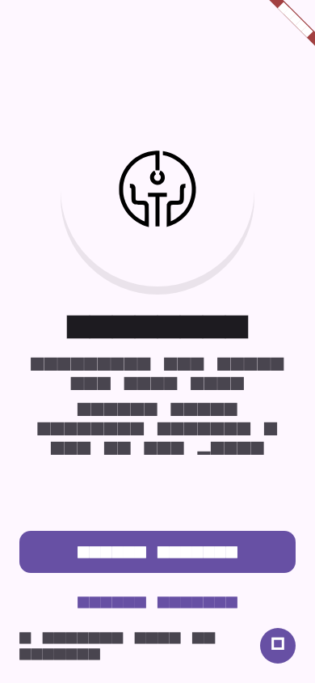
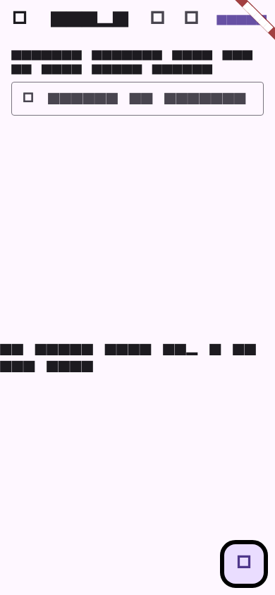
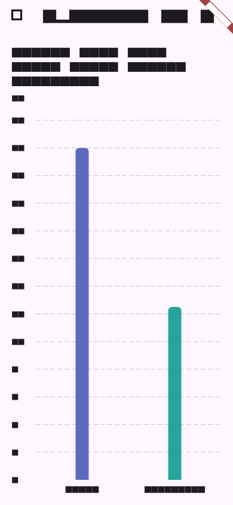

# Shop Paradise

Flutter storefront demo with **Riverpod**, **GoRouter**, and **Firebase**
(Authentication and Google Sign-In). It includes **offline shopping notes**
stored in **Drift (SQLite)**, a **spending-by-category** chart (**fl_chart**),
and **English / Kazakh / Russian** UI strings.

Screens below are generated from widget tests (`test/readme_screenshots_test.dart`)
so they stay in sync with real screens (Material 3 theme in tests uses system
fonts; the running app uses the full design theme from `AppTheme`).

## Screenshots

| Welcome | Shopping notes | Spending analytics |
| --- | --- | --- |
|  |  |  |

## Requirements

- Flutter SDK compatible with Dart `^3.9.2` (see `pubspec.yaml`).
- For Android: a valid `google-services.json` after Firebase setup.
- For iOS/macOS: `GoogleService-Info.plist` in the Runner targets.
- For codegen after editing Drift or other generated code:

  ```bash
  dart run build_runner build --delete-conflicting-outputs
  ```

## Run

```bash
flutter pub get
flutter run
```

Target a device or emulator as usual (`-d chrome`, `-d macos`, etc.).

### Web and Google Sign-In

1. Set the **Web OAuth client ID** in `web/index.html`:

   ```html
   <meta name="google-signin-client_id" content="YOUR_WEB_CLIENT_ID.apps.googleusercontent.com">
   ```

2. Pass the same ID at build/run time:

   ```bash
   flutter run -d chrome \
     --dart-define=GOOGLE_WEB_CLIENT_ID=YOUR_WEB_CLIENT_ID.apps.googleusercontent.com
   ```

Optional **iOS/macOS** client override:

```bash
flutter run --dart-define=GOOGLE_IOS_CLIENT_ID=YOUR_IOS_CLIENT_ID.apps.googleusercontent.com
```

If `GOOGLE_WEB_CLIENT_ID` is empty on mobile, the app falls back to the
**Web client (type 3)** from Firebase config (see
`lib/features/auth/data/google_sign_in_client_config.dart`).

See also [.env.example](.env.example) for copy-paste examples (Flutter does not
load `.env` in this project unless you add a package).

## Firebase configuration files

These paths are standard for FlutterFire. In **this repository**, the files
below are listed in `.gitignore` so secrets and per-environment configs are
not committed. After `git clone`, recreate them (team vault or Firebase Console).

- **Android:** `android/app/google-services.json`
- **iOS:** `ios/Runner/GoogleService-Info.plist`
- **macOS:** `macos/Runner/GoogleService-Info.plist` (if you ship macOS)
- **Dart options:** `lib/firebase_options.dart` — generate with
  [FlutterFire CLI](https://firebase.google.com/docs/flutter/setup):

  ```bash
  dart pub global activate flutterfire_cli
  flutterfire configure
  ```

Public OAuth client IDs are not secret; **never** commit private keys,
`google-services.json` from production if the repo is public, or Play/App
Store signing keystores.

## Release APK

```bash
flutter build apk --release
```

Output: `build/app/outputs/flutter-apk/app-release.apk`.

The project currently signs **release** with the **debug** keystore
(`android/app/build.gradle.kts`) so local `flutter build apk --release` works
without extra setup. Uploading to Google Play requires your own signing
configuration.

### GitHub Releases

1. Bump `version` in `pubspec.yaml` if needed.
2. Build the APK (above).
3. Tag and push, then attach the APK on GitHub **Releases**, e.g.:

   ```bash
   git tag -a v1.0.0 -m "Release v1.0.0"
   git push origin v1.0.0
   gh release create v1.0.0 build/app/outputs/flutter-apk/app-release.apk \
     --title "v1.0.0" --notes "Shopping notes, analytics chart, Google Sign-In."
   ```

   Without GitHub CLI: open the repo on GitHub → **Releases** → **Draft a new
   release** → choose the existing tag (e.g. `v1.0.0`) → upload
   `app-release.apk` as a binary attachment.

## Regenerate README screenshots

```bash
flutter test test/readme_screenshots_test.dart --update-goldens
```

## More documentation

- [docs/google-auth-profile-session.md](docs/google-auth-profile-session.md) —
  Google auth, profile, and session notes.
